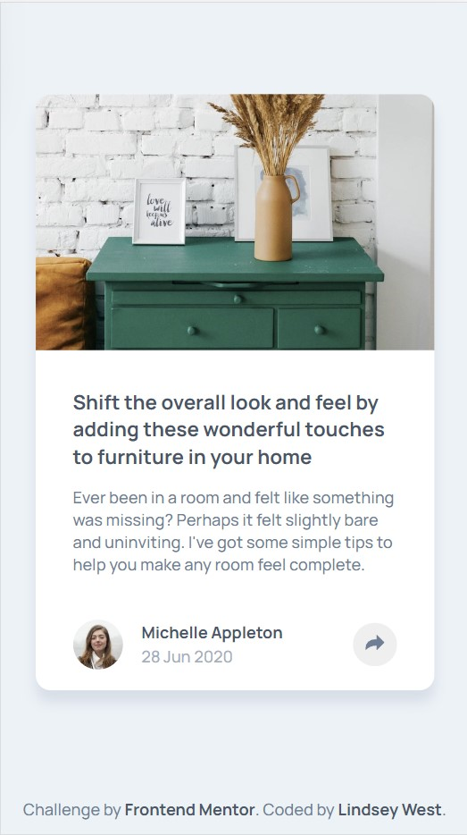
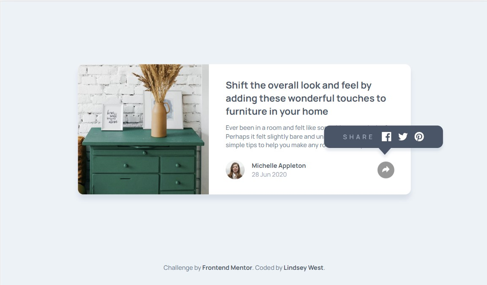

# Frontend Mentor - Article preview component solution

This is a solution to the [Article preview component challenge on Frontend Mentor](https://www.frontendmentor.io/challenges/article-preview-component-dYBN_pYFT). Frontend Mentor challenges help you improve your coding skills by building realistic projects. 

## Table of contents

- [Overview](#overview)
  - [The challenge](#the-challenge)
  - [Screenshot](#screenshot)
  - [Links](#links)
- [My process](#my-process)
  - [Built with](#built-with)
  - [What I learned](#what-i-learned)
  - [Continued development](#continued-development)
  - [Useful resources](#useful-resources)
- [Author](#author)
- [Acknowledgments](#acknowledgments)

## Overview

### The challenge

Users should be able to:

- View the optimal layout for the component depending on their device's screen size
- See the social media share links when they click the share icon

### Screenshot

### Links

- Solution URL: [Add solution URL here](https://your-solution-url.com)
- Live Site URL: [GitHub Pages](https://lw3st.github.io/Article-Preview-Component/)

## My process

### Built with

- Semantic HTML5 markup
- CSS variables
- Sass
- Flexbox
- Component-based CSS
- Mobile-first workflow
- Screen-reader and keyboard accessibility testing

### What I learned

This was my first time using a mobile-first workflow. It was much easier to make adjustments to media-based CSS than when I used a desktop-first workflow. I also experimented with creating component-based CSS, to attempt to make the article component more reusable if it were repeated across a real website. This was also my first time integrating ARIA tags in addition to semantic HTML, and changing ARIA status with Javascript. 

### Continued development

I would like to continue improving my knowledge of Javascript to create the most logical, efficient solutions for my projects. I would also like to continue learning about accessibility and creating responsive websites. For this project in particular, I would have liked to add animations for when the share menu appears when it's clicked, and I believe the Javascript solution I chose might have given me some trouble with this.

### Useful resources

- [Hubspot Accessible Dropdown Menu](https://blog.hubspot.com/website/accessible-drop-down-menus) - A helpful article on creating accessible dropdown and similar menus.
- [W3 Making Expandable ARIA states](https://www.w3.org/WAI/GL/wiki/Using_the_WAI-ARIA_aria-expanded_state_to_mark_expandable_and_collapsible_regions) - An article on using aria-expanded with dropdown menus, and other types of menus trigged by clicking on them.
- Advice from users Jay and Grace on the Frontend Mentor Slack group.

## Author

- GitHub - [Lindsey West](https://github.com/lw3st)
- Frontend Mentor - [@lw3st](https://www.frontendmentor.io/profile/lw3ste)

## Acknowledgments

Thank you to the users Jay and Grace on the Frontend Mentor Slack group for their advice as I was beginning my project.
